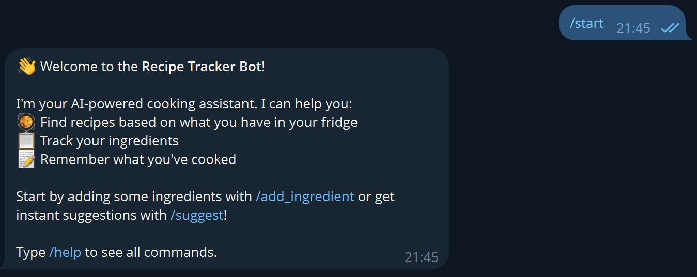
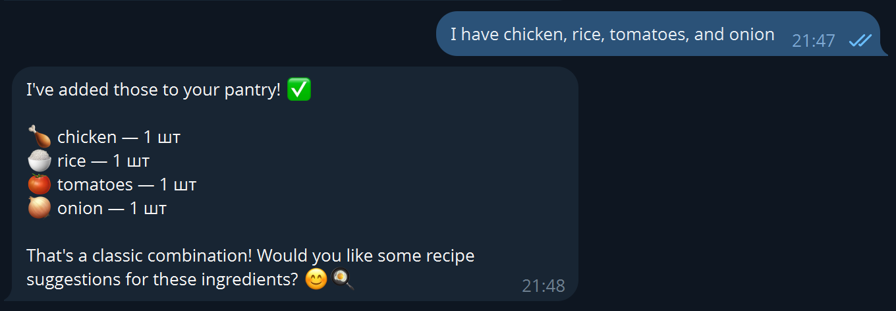
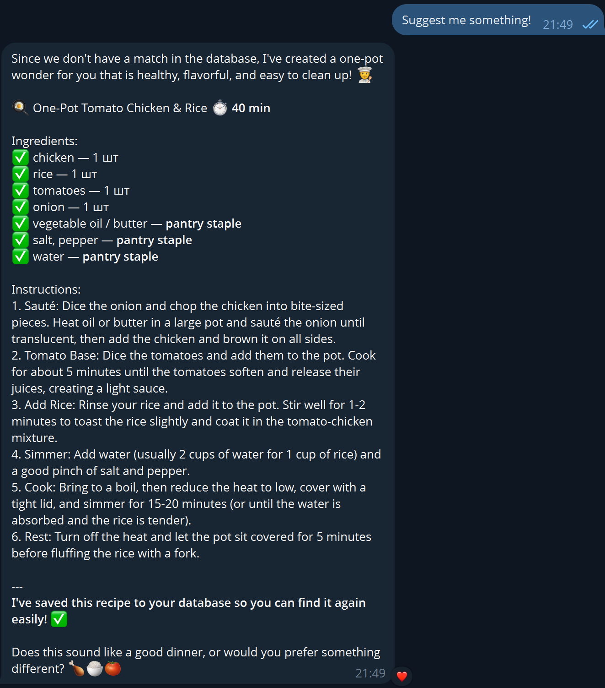
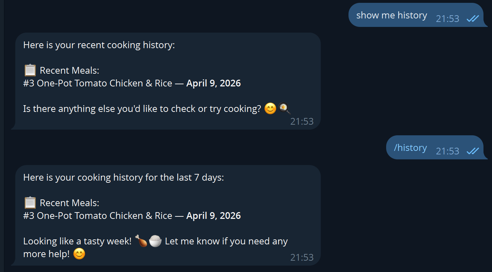

# Recipe Tracker — AI-Powered Recipe Bot for Telegram

A Telegram bot that tracks what you cook, manages your pantry ingredients, and uses an LLM agent to suggest recipes you can make with what you have.

---

## Demo

> **Screenshot 1:** Telegram bot `/start` command showing welcome message and instructions.


> **Sreenshot 2:** User adding ingredients (`I have chicken, rice, tomatoes, and onion`) and bot confirming each addition.

> **Screenshot 3:** User sending `/suggest` and bot displaying AI-generated recipe suggestions with cooking time.

> **Screenshot 4:** User selecting a recipe and bot confirming it was logged to cooking history.

**Example conversation:**
```
User: /start
Bot: 👋 Welcome to the Recipe Tracker Bot! I'm your AI-powered cooking assistant...

User: I have chicken, rice, tomatoes, and onion
Bot: ✅ Added: chicken — 500 g
     ✅ Added: rice — 2 cups
     ✅ Added: tomatoes — 3 pcs
     ✅ Added: onion — 1 pcs

User: /suggest
Bot: Based on your ingredients, you can make:
     🍗 **Chicken Rice Bowl** (20 min)
     🍅 **Tomato Chicken Curry** (35 min)
     Reply with a number to cook it!

User: 2
Bot: ✅ Logged "Tomato Chicken Curry"!
```

---

## Product Context

| Aspect | Details |
|--------|---------|
| **End Users** | Home cooks, students, anyone who wants to reduce food waste and discover new recipes |
| **Problem** | People have ingredients at home but don't know what to cook. Recipe sites require searching through irrelevant results. |
| **Solution** | A Telegram bot where you list what you have, and an AI agent instantly suggests matching recipes, tracks your cooking history, and answers follow-up questions naturally. |

---

## Architecture

```
[User] → [Telegram Bot] → [WebSocket] → [Recipe Agent (LLM + MCP)]
                                                    |
                                            [MCP Server]
                                                    |
                                          [FastAPI Backend API]
                                                    |
                                               [PostgreSQL]
```

### Components

| Component | Technology | Description |
|-----------|-----------|-------------|
| **Telegram Bot** | `python-telegram-bot` | End-user client, connects to agent via WebSocket |
| **Recipe Agent** | Python + `websockets` + `openai` | AI agent with LLM reasoning and MCP tool calling |
| **MCP Server** | `mcp` SDK | Stdio-based tool server (ingredients, recipes, cooking log) |
| **Backend API** | FastAPI + SQLModel + async SQLAlchemy | REST API with Bearer token auth |
| **Database** | PostgreSQL 18 | Persistent storage for users, ingredients, recipes, cooking logs |
| **LLM Provider** | Ollama Cloud (OpenAI-compatible API) | Connects to Ollama API for LLM reasoning and MCP tool calling |

---

## Features

### Implemented (Version 1)
- ✅ Telegram bot with natural language interaction
- ✅ Ingredient management (add, view, remove)
- ✅ AI-powered recipe suggestions via LLM + MCP tools
- ✅ Cooking history tracking (last 7 days)
- ✅ WebSocket communication between bot and agent
- ✅ LLM agent with tool calling (MCP stdio)
- ✅ FastAPI backend with async SQLAlchemy
- ✅ PostgreSQL with proper schema and foreign keys
- ✅ Bearer token authentication on all API endpoints
- ✅ `--test` mode for the agent (development & debugging)
- ✅ Docker Compose for all services
- ✅ pydantic-settings configuration from env vars

### Not Yet Implemented (Future)
- ⬜ Pre-populated recipe database with diverse recipes
- ⬜ Image-based ingredient recognition
- ⬜ Meal planning for the week
- ⬜ Shopping list generation
- ⬜ Nutritional information
- ⬜ User ratings and recipe popularity
- ⬜ Multi-language support

---

## Bot Commands

| Command | Description |
|---------|-------------|
| `/start` | Welcome message and instructions |
| `/add_ingredient` | Interactive: add ingredients to your pantry |
| `/my_ingredients` | Show your current ingredient list |
| `/suggest` | **AI analyzes your ingredients and suggests recipes** |
| `/cooked` | Log a recipe you just cooked |
| `/history` | View cooking history (last 7 days) |
| `/clear_history` | Clear all cooking history |
| `/help` | List all available commands |

---

## Usage

### Quick Start (Docker Compose)

1. **Copy and fill in the environment file:**
   ```bash
   cp .env.docker.example .env.docker.secret
   # Edit .env.docker.secret with your actual values
   ```

2. **Set your Telegram bot token:**
   - Open Telegram, find `@BotFather`
   - Send `/newbot` and follow instructions
   - Copy the token into `.env.docker.secret` as `BOT_TOKEN`

3. **Set your Ollama API key:**
   - Get your API key from [https://ollama.com](https://ollama.com)
   - Copy the key into `.env.docker.secret` as `OLLAMA_API_KEY`
   - The default base URL is `https://ollama.com/v1` (change `OLLAMA_BASE_URL` if needed)

4. **Start all services:**
   ```bash
   docker compose up --build -d
   ```

5. **Open your Telegram bot and send `/start`!**

### Development Mode (without Docker)

1. **Start PostgreSQL:**
   ```bash
   docker run -d --name postgres \
     -e POSTGRES_DB=recipe_db \
     -e POSTGRES_USER=recipe_user \
     -e POSTGRES_PASSWORD=devpassword \
     -p 5432:5432 postgres:18-alpine
   ```

2. **Create `.env.docker.secret`:**
   ```
   RECIPE_API_KEY=dev-key
   POSTGRES_PASSWORD=devpassword
   BOT_TOKEN=your-bot-token
   OLLAMA_API_KEY=your-ollama-api-key
   OLLAMA_BASE_URL=https://ollama.com/v1
   RECIPE_AGENT_LLM_MODEL=qwen2.5-coder:7b
   RECIPE_AGENT_ACCESS_KEY=local-agent-key
   ```

3. **Start the backend:**
   ```bash
   cd backend
   uv run uvicorn main:app --reload --port 8000
   ```

4. **Start the agent:**
   ```bash
   cd recipe-agent
   uv run python -m recipe_agent.agent
   ```

5. **Start the Telegram bot:**
   ```bash
   cd client-telegram-bot
   uv run python -m telegram_bot.bot
   ```

6. **Test the agent directly:**
   ```bash
   cd recipe-agent
   uv run python -m recipe_agent.agent --test "/suggest"
   ```

---

## Deployment

### Prerequisites
- **OS:** Ubuntu 24.04 (or any Linux with Docker)
- **Docker** and **Docker Compose** installed
- **Telegram Bot Token** from @BotFather
- **Ollama API Key** from [https://ollama.com](https://ollama.com)

### Step-by-Step

1. **Clone the repository:**
   ```bash
   git clone <your-repo-url> meal-planner
   cd meal-planner
   ```

2. **Configure secrets:**
   ```bash
   cp .env.docker.example .env.docker.secret
   nano .env.docker.secret  # Fill in real values
   ```

3. **Build and start:**
   ```bash
   docker compose up --build -d
   ```

4. **Verify services are running:**
   ```bash
   docker compose ps
   docker compose logs -f backend   # Check backend logs
   docker compose logs -f recipe-agent  # Check agent logs
   ```

5. **Test the bot:**
   - Open Telegram, find your bot
   - Send `/start`
   - Add ingredients and try `/suggest`

### Service URLs (after deployment)

| Service | URL |
|---------|-----|
| Backend API | `http://<server-ip>:8000` |
| Health Check | `http://<server-ip>:8000/health` |
| Recipe Agent WS | `ws://<server-ip>:8765/ws/chat` |

---

## Project Structure

```
meal-planner/
├── backend/                      # FastAPI REST API
│   ├── main.py                   # App entry point + lifespan
│   ├── config.py                 # pydantic-settings configuration
│   ├── pyproject.toml            # uv dependencies
│   ├── models/                   # SQLModel schemas
│   ├── db/                       # async CRUD operations
│   └── routers/                  # HTTP endpoint handlers
├── recipe-agent/                 # AI agent with LLM + MCP
│   ├── recipe_agent/
│   │   ├── agent.py              # Entry point (--test mode + WebSocket server)
│   │   ├── config.py             # Settings
│   │   ├── handler.py            # Core message handler
│   │   ├── llm_client.py         # OpenAI-compatible LLM client
│   │   ├── mcp_client.py         # MCP stdio client
│   │   └── system_prompt.txt     # LLM system prompt
│   ├── pyproject.toml
│   └── Dockerfile
├── mcp/mcp_recipes/              # MCP tool server
│   ├── server.py                 # MCP tools (get_ingredients, suggest_recipes, etc.)
│   ├── api_client.py             # HTTP client for backend API
│   ├── config.py
│   ├── pyproject.toml
│   └── Dockerfile
├── client-telegram-bot/          # Telegram bot
│   ├── telegram_bot/
│   │   ├── bot.py                # Bot commands and handlers
│   │   ├── ws_client.py          # WebSocket client to agent
│   │   └── config.py
│   ├── pyproject.toml
│   └── Dockerfile
├── docker-compose.yml            # All services wired together
├── .env.docker.example           # Environment template
├── .gitignore
└── LICENSE                       # MIT
```

---

## Key Design Decisions

1. **LLM-driven, not hardcoded** — The LLM decides which tools to call based on tool descriptions, not regex or keyword matching.
2. **MCP tools** — Clean separation between the agent's reasoning and the backend's data operations.
3. **`--test` mode** — Essential for development: test the agent without the full stack.
4. **No secrets in git** — All credentials from `.env.docker.secret`, which is gitignored.
5. **uv + pyproject.toml** — Modern Python dependency management.
6. **async SQLAlchemy** — Non-blocking database operations throughout.
